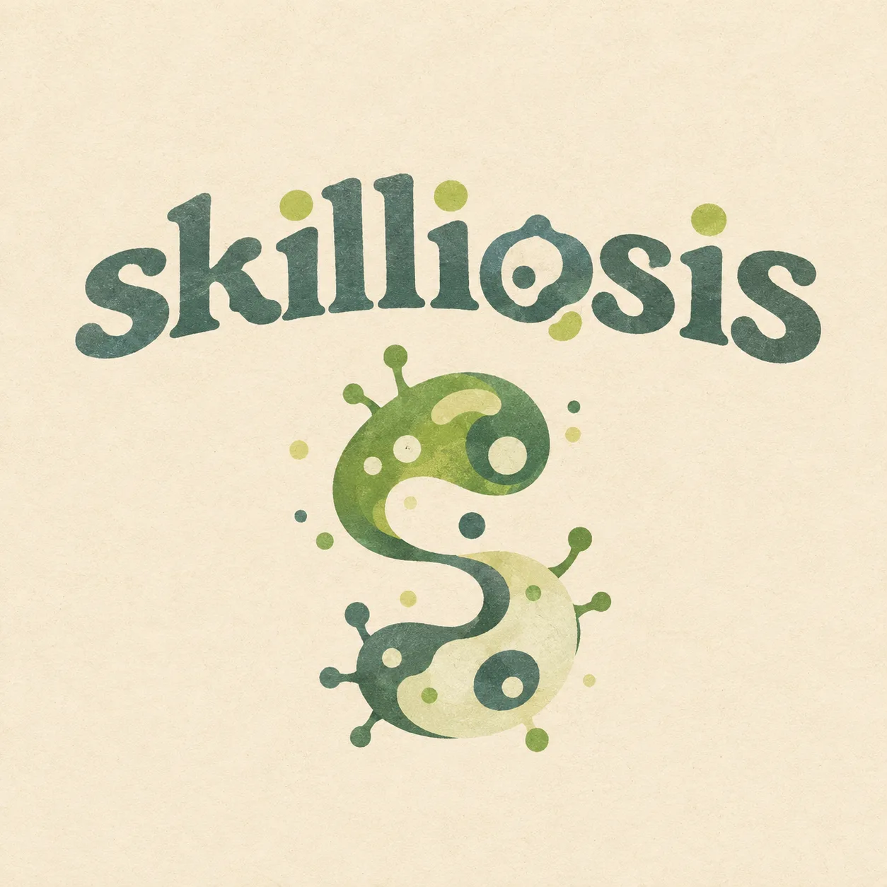
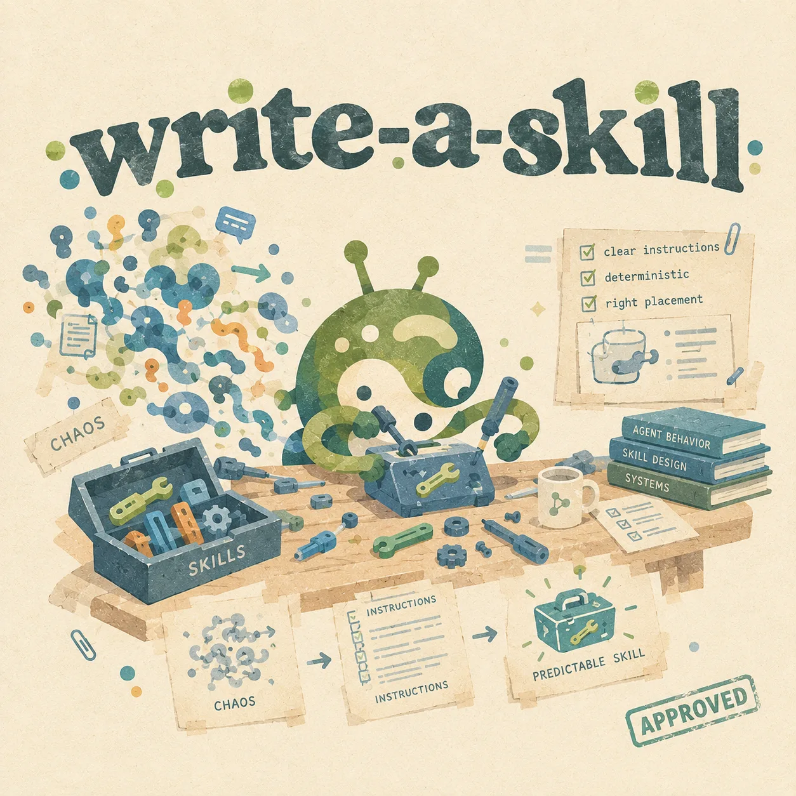

A colony of agent skills, cultured in the author's daily `~/.omp` and spoken
in the open `SKILL.md` language. Any harness can graft them in - Claude Code,
Codex, DeepSeek Harness, opencode, OMP. Prognosis: benign.

## The agents

<table>
<tr>
<td width="40%">

</td>
<td width="60%">
<strong><a href="skills/architect-partner/">architect-partner</a></strong> - a design partner for architecture work: subsystems, storage, data flow.
<br><br>
One contract at a time - a spec file agreed with you first. Every decision is locked with you before any action; every claim is anchored to a verbatim quote: no quote, no statement.
<br><br>
Ships with three sub-skills: <em>calculator</em> (sizing workbooks), <em>data-architect</em> (data-systems mentoring), <em>reflection</em> (post-mortems and the quote book).
</td>
</tr>
</table>

<table>
<tr>
<td width="40%">

</td>
<td width="60%">
<strong><a href="skills/write-a-skill/">write-a-skill</a></strong> - the methodology this colony is grown with.
<br><br>
What makes a skill deterministic, where to plant it - global or per project - and how to audit it afterwards. Every skill in this colony was written against it.
</td>
</tr>
</table>

## Install

The installer detects the harnesses present on your machine and asks where
to put the skills. Point it at a folder yourself with `--dest` when you know
better.

Linux, macOS:

```sh
curl -fsSL -o /tmp/skilliosis-install.sh https://raw.githubusercontent.com/veschin/skilliosis/main/install.sh
bash /tmp/skilliosis-install.sh
```

Windows (PowerShell 5.1+):

```powershell
Invoke-WebRequest -UseBasicParsing -Uri "https://raw.githubusercontent.com/veschin/skilliosis/main/install.ps1" -OutFile "$env:TEMP\skilliosis-install.ps1"
& "$env:TEMP\skilliosis-install.ps1"
```

No questions? Pick the destination folder yourself:

```sh
bash /tmp/skilliosis-install.sh --dest ~/.claude/skills
```

```powershell
& "$env:TEMP\skilliosis-install.ps1" -Dest "$env:USERPROFILE\.claude\skills"
```

The other flags (PowerShell spellings in parentheses):

- `--skill NAME` (`-Skill NAME`) - install a single skill, e.g. `--skill write-a-skill`
- `-y` (`-Yes`) - install into every detected harness, no picker
- `--list` (`-List`) - show what was detected, install nothing

> [!TIP]
> One folder can feed several tools: `.claude/skills` serves Claude Code and
> opencode, `.agents/skills` serves DeepSeek Harness, opencode and recent
> Codex builds. Restart Codex after installing - it scans skills at startup.

<details>
<summary>Manual install and the full destination table</summary>

No script? The skills are plain folders in the repo tarball - copy them
wherever your harness looks. `DEST` is the folder from the table below
(`~` is `%USERPROFILE%` on Windows):

```sh
DEST="${DEST:-$HOME/.claude/skills}"; mkdir -p "$DEST"; curl -fsSL https://github.com/veschin/skilliosis/archive/refs/heads/main.tar.gz | tar -xz --strip-components=2 -C "$DEST" skilliosis-main/skills
```

```powershell
$dest="$env:USERPROFILE/.claude/skills"; New-Item -ItemType Directory -Force -Path $dest | Out-Null; $t="$env:TEMP/skilliosis.tar.gz"; Invoke-WebRequest -UseBasicParsing -Uri "https://github.com/veschin/skilliosis/archive/refs/heads/main.tar.gz" -OutFile $t; tar -xzf $t -C $dest --strip-components=2 skilliosis-main/skills; Remove-Item $t
```

| Harness | Personal | Per project |
| --- | --- | --- |
| Claude Code | `~/.claude/skills` | `.claude/skills` |
| OpenAI Codex | `~/.codex/skills` | no native support - set `CODEX_HOME` per project |
| DeepSeek Harness | `~/.agents/skills` (or `~/.dsh/skills`) | `.agents/skills` (or `.dsh/skills`) |
| opencode | `~/.config/opencode/skills` | `.opencode/skills` |
| OMP | `~/.omp/agent/managed-skills` | `.omp/skills` |

Windows needs `tar.exe`, built in since Windows 10 1803. Append a skill name
to the archive path to install just that skill.

</details>

Every skill carries its host's quirks (paths, versions, local workflows).
Expect to adapt those to your setup.
